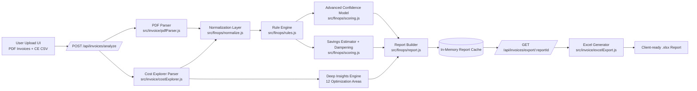

# Presales FinOps Cost Optimization: Architecture and Algorithm

This document explains how the current tool performs AWS cost optimization from uploaded invoices and Cost Explorer data.

## 1) Architecture Diagram



## 2) Algorithm Diagram

```mermaid
flowchart TD
  A[Start Analysis] --> B[Ingest Files\nPDF + CE CSV]
  B --> C[Extract Totals/Services/Rows]
  C --> D[Build Canonical Cost Model]

  D --> E[Run Deterministic FinOps Rules]
  E --> E1[Compute: idle/rightsize/old gen]
  E --> E2[Storage: EBS/Snapshots/S3 tiering]
  E --> E3[Network + LB + EIP]
  E --> E4[Commitments + RDS snapshots]

  E4 --> F[Calculate 6-Layer Confidence]
  F --> F1[Data Quality 20%]
  F --> F2[Visibility 15%]
  F --> F3[Signals 25%]
  F --> F4[Commitment 15%]
  F --> F5[Historical 10%]
  F --> F6[Heuristic 15%]

  F6 --> G[Estimate Raw Savings\n(benchmarked category %)]
  G --> H[Apply Confidence Dampening\nadjusted = raw * confidence%]
  H --> I{Confidence < 60?}
  I -- Yes --> J[Apply Extra -20% Penalty]
  I -- No --> K[Keep Adjusted]
  J --> L[Build Accuracy Band\nmin=raw*0.7, max=raw*1.2]
  K --> L

  L --> M[Generate Deep Insights\n(12 headers + trend + action)]
  M --> N[Assemble JSON Report]
  N --> O[Export Excel\nExecutive + Deep Insights + Scoring Matrix]
  O --> P[End]
```

## 3) Confidence and Savings Logic (Implemented)

### Confidence Score

```
Confidence =
  (DataQuality * 0.20) +
  (Visibility * 0.15) +
  (Signals * 0.25) +
  (Commitment * 0.15) +
  (Historical * 0.10) +
  (Heuristic * 0.15)
```

### Savings Adjustment

```
AdjustedSavings = RawEstimatedSavings * (Confidence / 100)

If Confidence < 60:
  AdjustedSavings = AdjustedSavings * 0.80

AccuracyBand:
  Min = RawEstimatedSavings * 0.70
  Max = RawEstimatedSavings * 1.20
```

## 4) 12 Optimization Areas Covered

1. EBS volumes with older generation  
2. Unused EBS Volumes  
3. Provisioned IOPS EBS  
4. Old EBS Snapshots  
5. Unused EIP  
6. Previous Generation EC2  
7. Idle EC2 Instances  
8. EC2 rightsizing  
9. Unused/Idle Load balancers  
10. Commitment (Savings Plans/RI)  
11. RDS Manual Snapshot Deletion  
12. S3 Teiring  

## 5) Where to Extend Next

- Add CloudWatch utilization import (for stronger EC2/RDS confidence)
- Add resource-level action sheet (instance/volume IDs) in Excel
- Add implementation owner/status tracking sheet for delivery governance

