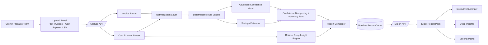
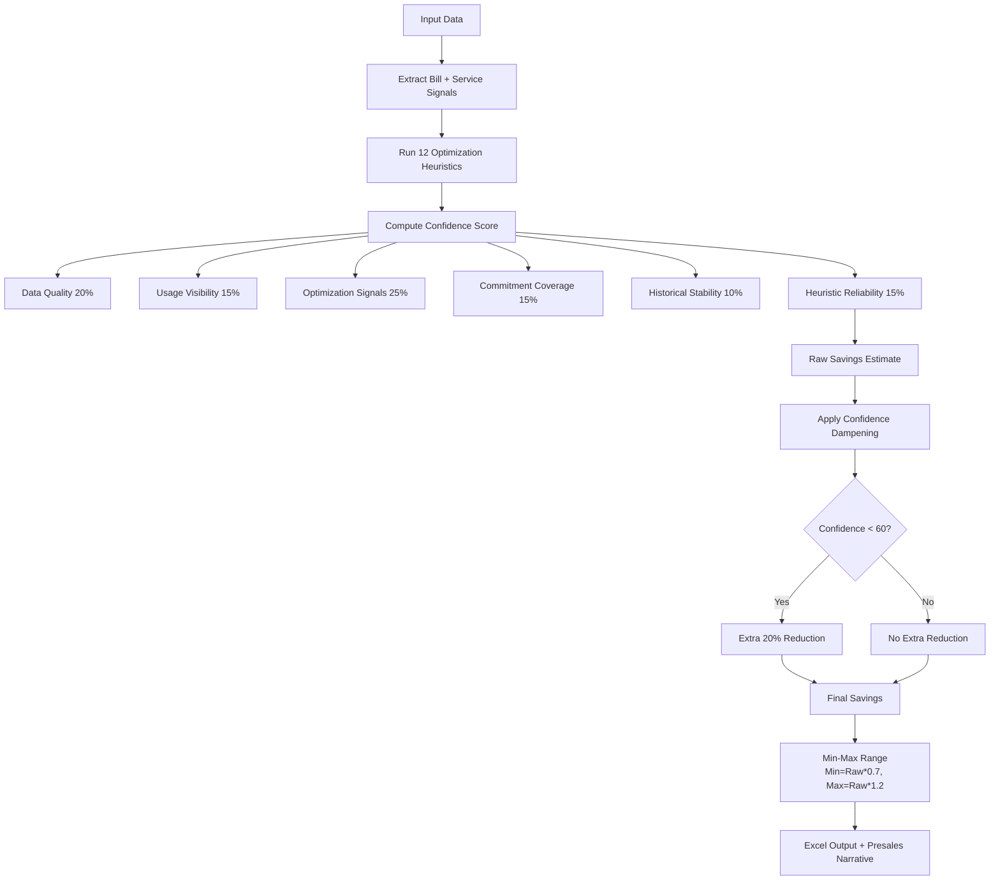

# FinOps Cost Optimization Engine: One-Page Visual

## Architecture View



---

## Algorithm View



---

## Prioritization Lens

```mermaid
quadrantChart
    title FinOps Action Prioritization (Impact vs Ease)
    x-axis Low Ease --> High Ease
    y-axis Low Impact --> High Impact
    quadrant-1 Quick Wins
    quadrant-2 Strategic Bets
    quadrant-3 Backlog
    quadrant-4 Planned Improvements
    Idle EC2: [0.86, 0.92]
    Unused EBS: [0.84, 0.88]
    Unused EIP: [0.93, 0.40]
    Old Snapshots: [0.90, 0.68]
    EC2 Rightsizing: [0.58, 0.88]
    Commitment (SP/RI): [0.50, 0.94]
    S3 Tiering: [0.78, 0.72]
```

---

## Executive Formula Strip

```text
Confidence =
(DataQuality*0.20) + (Visibility*0.15) + (Signals*0.25) +
(Commitment*0.15) + (Historical*0.10) + (Heuristic*0.15)

AdjustedSavings = RawEstimatedSavings * (Confidence/100)
If Confidence < 60 => AdjustedSavings = AdjustedSavings * 0.80
Range: Min = Raw*0.70 | Max = Raw*1.20
```

